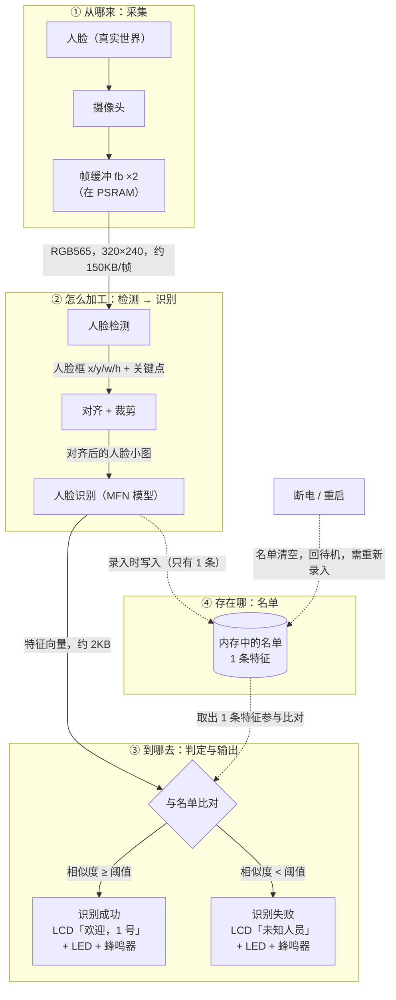

# ESP32 本地人脸识别门禁演示器 · 技术设计（TECH_DESIGN.md）

> 文档版本：v1.1　｜　建立：2026-09-21　｜　v1.1 回填：2026-09-22
> 对应阶段：Day 5 建立技术路线与数据流图；Day 6 前完成契约回填
> 上游文档：`PRD.md`（产品边界与验收基线）、`research.md`（背景研究）
> 下游：Day 6 起的编码与调试
>
> 本文只回答「**用什么做、为什么**」，不含代码。产品「做什么、做到什么程度」以 `PRD.md` 为准，两者冲突时以 PRD 为准。
>
> **命名说明**：本文即 `PRD.md` 第 6 节所指的实现契约文档。Day 5 决定**改名为 `TECH_DESIGN.md`**，原暂定名 `IMPLEMENTATION_CONTRACT.md` 作废，两者是同一个东西，不并存。
>
> **v1.1 修订记录**（清理 Day 5 遗留项）：
> ① **契约回填完成**：PRD 第 6 节要求的 ③④⑤⑥⑦⑧⑨⑩ 全部定稿，落在第 4–7 节；
> ② **口径变更**：帧率相关规则由 PRD 2.3 的「帧数」口径统一改为「**时间**」口径（逐条换算依据见第 4 节）。原因：目标帧率尚未实测，帧数口径会让同一条规则在不同帧率下变成不同的实际时长；
> ③ **待决项结案**：D1（Flash vs 内存）、D3（图像接口）经源码核实结案，D5（LED 模式）定稿，D6 补出「挪 PSRAM 的前置条件」，新增 **D8**（示例的「恰好 1 张脸」判断与 PRD R9 冲突）；
> ④ **事实补强**：第 9 节新增 **7 条**事实，其中最关键的是「本地两处 esp-who 快照的 `components/esp-dl` 都是空子模块」与「`camera.c:75` 没有判断 `esp_camera_init` 返回值」。
>
> **本次核实的证据基准**：本地 `D:\esp-who-1.1.0` 与官方 tag `v1.1.0` **逐字节一致** —— `components/modules/ai/who_human_face_recognition.cpp` 的 git blob 哈希 `9f900a416f5c900d5f6f4bed13633d92c012f6d5`，与 GitHub API `ref=v1.1.0` 返回的 sha 完全相同；其 pin 的 esp-dl 子模块提交为 `78a81eb0a20c19ff2ad982850082784eba7594e1`。注意该仓库 `CHANGELOG.md` 只写到 1.0.0（上游未更新），**不能用 CHANGELOG 判断版本**。

---

## 0. 一句话技术路线

> 在**正点原子 DNESP32S3**（ESP32-S3 双核 240MHz／16MB Flash／8MB PSRAM）上，用 **ESP-IDF 5.1.2** 搭配 **esp-who release/v1.1.0**，复用仓库已有的 **esp32-camera 驱动**采集 **RGB565／QVGA 320×240** 画面，调用 esp-who 的人脸检测与人脸识别组件在**设备本地**判出「已录入／未知」，结果经现有的 **2.4 寸 SPI LCD** 上屏，并由板载 **LED** 与 **XL9555 蜂鸣器**给出成功／失败反馈。

---

## 1. 技术路线表

「为什么」一列写选择理由，「没选什么」写被放弃的选项，「改主意的条件」写什么情况下要推翻这一行——这一列是给未来的自己留的出口。

| # | 层 | 选什么 | 为什么选它 | 没选什么 | 改主意的条件 |
|---|---|---|---|---|---|
| 1 | 开发板 | 正点原子 DNESP32S3 | 板子已在手；仓库里的 camera/lcd/led/xl9555 驱动**已针对本板适配并跑通** | 不采购 ESP32-S3-EYE：没必要，且会让已跑通的驱动作废 | — |
| 2 | 芯片 / 主频 | ESP32-S3，双核 240MHz | 板上既有事实 | — | — |
| 3 | 框架（SDK） | ESP-IDF **5.1.2** | 已安装、已编译通过；esp-who v1.1.0 声明基于 IDF 5.0，5.1.2 与 5.0 属同一大版本，API 差异小 | **不升到 5.4/5.5**：新版 esp-who 要求 IDF 5.4+，但它同时弃用了 esp32-camera，会把唯一跑通的摄像头驱动推倒重来 | 若 esp-who v1.1.0 在 5.1.2 下编译失败 → 回退到「升级 IDF」或「只用 esp-dl」（见第 8 节 D2） |
| 4 | 人脸能力来源 | **esp-who release/v1.1.0** | 技术栈与现有代码一致（同用 esp32-camera + esp-dl）；覆盖面正好是 PRD 需要的「检测 + 识别」 | 不用 esp-who master：要求 IDF 5.4+ 且已改用 esp_video、放弃 esp32-camera；不自己基于 esp-dl 从零搭：工作量与风险都超出周期 | 同第 8 节 D2；若该分支核心能力缺失，则降为「只取 esp-dl 的模型层」 |
| 5 | 摄像头驱动 | 仓库已有 `components/CAMERA`（基于 esp32-camera 2.1.7） | 已跑通；PWDN/RESET 已改为经 XL9555 控制，正好匹配正点原子板 | 不用 esp-who 自带的 `who_cam`：它只适配官方板，不支持本板 | 若 esp-who 的图像输入接口与 `esp_camera_fb_t` 对接不上（第 8 节 D3） |
| 6 | 图像格式 / 分辨率 | **RGB565 + QVGA（320×240）**，双缓冲，帧缓冲放 PSRAM | 与 esp-who 检测／识别的输入格式一致；QVGA 是 esp-who 示例的默认档；PSRAM 8MB 充裕 | 不上 VGA：帧率和内存代价都显著变大，当前阶段无收益 | 若 QVGA 下识别率达不到 A4 的 8/10 |
| 7 | 结果显示 | 仓库已有 `components/LCD`（2.4 寸 SPI LCD，ILI9341 类，320×240） | 已跑通；正好符合 PRD「屏幕是唯一产品输出」 | 不用 esp-who 的 `who_lcd`：只支持 S3-EYE 的 st7789 屏 | — |
| 8 | 反馈（LED / 蜂鸣器） | 板载 **LED（GPIO1）** + **XL9555 蜂鸣器**（`BEEP_IO`） | 两者都已在现有 BSP 里，蜂鸣器一行调用即可驱动 | 不做 RGB 灯：**板载只有单色一颗 LED** | PRD 4.4 的 A6「两种可区分模式」只能用**亮/灭 + 闪烁次数**表达，颜色不可用（第 8 节 D5） |
| 9 | 名单与人脸数据存放 | **内存**（遵循 PRD 2.2） | PRD 明确规定名单不写 Flash、重启清空；这是**你 Day 4 拍过板的决定** | 暂不采用 esp-who 默认行为（写入 Flash 的 `fr` 分区） | 见第 8 节 D1：PRD 暂不改，**Day 6 实测后由你决定**，实测前不得在代码里自行决定 |
| 10 | 分区表 | 需**新建 `partitions.csv`**（含 esp-who 所需的模型与人脸分区） | 现工程用默认单 app 分区，装不下 esp-who 的模型文件 | — | Day 6 按 esp-who v1.1.0 示例自带的 `partitions.csv` 落地；官方已确认其中 `fr` 分区用于存录入人脸，默认 128K；Flash 16MB，空间充足 |
| 11 | 录入触发方式 | 按 PRD 2.1：**上电后首次检测到人脸即进入录入** | 名单为空且只录 1 人，自动触发最省事 | 按键触发作为备选 | PRD 7 节把此项列为待确认；硬件上 **KEY0–KEY3 四个按键都可用**（走 XL9555），演示体验若混乱即可改按键触发（PRD 5 节的降级方案） |

---

## 2. 为什么「暂时」选这套路线

用户已明确采用示范路线、不做多方案比较，但必须交代「为什么暂时是它」。理由三条：

1. **能跑通优先于版本新。** 仓库里 camera / lcd / led / xl9555 四个驱动是当前**唯一已经被验证过的东西**。esp-who v1.1.0 用的正是同一套 esp32-camera + esp-dl 技术栈，能直接接上。
2. **新版本反而不划算。** esp-who master 要求 IDF 5.4/5.5/6.x，并且**已经放弃 esp32-camera、改用 esp_video**。采用它等于把唯一跑通的部分推倒重来，还要再装一套工具链。
3. **周期账。** 28 天里，「重装工具链 + 重写摄像头驱动 + 适配非官方板型」的风险和耗时，明显大于「使用一个停止更新但功能完整的旧分支」。

**这条路线什么时候需要改主意**：第 1 节表格最后一列，以及第 8 节的 D1–D8。

---

## 3. 数据流图

> 一张图回答一个问题：**摄像头拍到的画面，最后是怎么变成屏幕上那行「欢迎，1 号」的？**
> 每根箭头上标的都是「这一段数据是什么」。图下的表再补上「格式／多大／存在哪／活多久」。

### 3.1 逐段数据说明

「活多久」这一列是重点——它决定了「重启后还在不在」，也就是 PRD A8 / A9 要考的东西。

| # | 数据 | 格式 | 多大 | 存在哪 | 活多久 | 依据 |
|---|---|---|---|---|---|---|
| 1 | 摄像头帧 | RGB565 | 320×240×2 = **153,600 B ≈ 150KB／帧** | 帧缓冲 `fb`×2，在 **PSRAM** | 用完立刻还给驱动（`esp_camera_fb_return`），不累积 | `camera.c` |
| 2 | 人脸框 + 关键点 | 结构体（x/y/w/h + 关键点坐标） | 几十字节级 | 内存 | 只对当前帧有效 | `esp-who`，字段待 Day 6 实测 |
| 3 | 对齐后的人脸小图 | 由模型输入尺寸决定 | 待实测 | 内存 | 只对当前帧有效 | Day 6 实测 |
| 4 | **人脸特征向量** | float 数组 | **约 2KB／人**（推算值，见下方注） | **内存**（按 PRD 2.2） | 断电即消失（按 PRD）；esp-who 默认写 Flash 则永存 → **见第 8 节 D1（已结案：走内存）** | 官方文档 + 推算，Day 6 核实 |
| 5 | **名单** | 1 条特征 | 约 2KB | **内存** | **断电清空**（PRD 2.2 / A8）；需重新录入 | `PRD.md` 2.2 |
| 6 | 判定结果 | 枚举：已录入／未知 | 1–2 字节 | 内存变量，由状态机持有 | 保持到该人离开（PRD R10） | `PRD.md` 2.1 / 2.3 |
| 7 | 屏幕内容 | RGB565 像素 + 字符 | 整屏 150KB | `lcd_buf`（静态数组，占**片内 SRAM**） | 刷新即覆盖 | `lcd.h` |
| 8 | LED / 蜂鸣器指令 | 电平（亮/灭、鸣/停） | 1 bit | GPIO1 电平 / XL9555 寄存器 | 由 PRD 4.4 的模式决定 | `led.c`、`xl9555.h` |

> **第 4 行那个「约 2KB」是怎么来的**：官方原文给出「默认 `fr` 分区 128K，最多存 62 个 ID」（出处：`esp-who-1.1.0/examples/human_face_recognition/README_CN.md`，日志行 `I (1070) MFN: fr partition size: 131072 bytes, maxminum 62 IDs can be stored`），128 × 1024 ÷ 62 ≈ **2114 字节／人**；按 4 字节一个 float 反推约 **512 维特征**，512 × 4 = 2048 B，加上少量头信息正好凑到 2114 B。这是**推算，不是实测**。
> **v1.1 补充**：本次核实**没能确认特征维度**（理由见第 9 节：esp-dl 源码是未拉取的空子模块），因此本行仍维持「推算」标注，不得当成实测值引用。

### 3.2 两条必须画出来的支线

| 支线 | 走向 | 为什么必须画 |
|---|---|---|
| **未录入人员** | 比对失败 → LCD「未知人员」+ LED/蜂鸣器 → **不写入名单** | PRD F5 的核心行为：认不出的人不能被写成某个已录入编号，也不能污染名单 |
| **断电 / 重启** | 名单清空 → 回待机 → 需重新录入 | PRD 2.2 / A8 / A9 都挂在这条线上，也是「数据存在哪」这个问题的最终答案 |

> ⚠️ **图中的「内存中的名单」是 PRD 的要求，不是 esp-who 示例的默认做法。** esp-who 的示例把录入的人脸写进 Flash 的 `fr` 分区（掉电不丢）。**但这不强制**：esp-dl 的 `enroll_id(..., bool update_flash = false)` 默认就不写 Flash，是示例自己传了 `true`。处置见第 8 节 **D1**（已结案：走内存，PRD 无需改动）。

---

## 4. 行为规则与参数定稿（契约项 ③④⑤⑥⑨）

> 本节把 `PRD.md` 2.3 / 4.4 的暂定值定稿。**本节列出的数值都是「写代码前必须定稿」的参数**；未列出的仍按 PRD 原文执行。
>
> **口径变更（重要，这是一次与 PRD 原文不同的表达）**：PRD 2.3 用「连续 N 帧」描述时序规则，本版统一改为「连续 N 毫秒」。原因：目标帧率尚未实测（见 4.3），而帧数口径会让同一条规则在不同帧率下变成**不同的实际时长**（15 帧在 15fps 下是 1 秒，在 7fps 下变成 2.1 秒）。
>
> 换算一律以 **PRD R4 自带的锚点**为准：PRD 原文写「连续丢失 15 帧（约 1 秒）」→ 15 帧 ≈ 1000 ms → **1 帧 ≈ 66.7 ms**。凡由该锚点换算出来的值，一律标注「**推算**」，等实测帧率后复核。

### 4.1 行为规则定稿

| 编号 | 规则 | 定稿值 | 与 PRD 的关系 | 依据 |
|---|---|---|---|---|
| R1 | 录入采样量 | 连续采集 **10 张**合格人脸后录入完成 | 沿用 PRD 暂定值，不改 | 这是「采样张数」，不是时间口径，**不受帧率影响**；`PRD.md` 2.3 R1 |
| R2 | 录入超时 | 进入录入后 **15000 ms** 未完成 → 中止，回待机 | 沿用 PRD「15 秒」，仅改写为毫秒 | `PRD.md` 2.3 R2 |
| R3 | 录入中人脸消失 | 连续丢失 **≥ 200 ms** → 中止录入，回待机 | PRD 原为「连续 3 帧」，改时间口径 | **推算**：3 × 66.7 ms ≈ 200 ms |
| R4 | 「人离开画面」判定 | 连续丢失 **≥ 1000 ms** 才判定离开 | PRD 原为「15 帧（约 1 秒）」；**时间值取自 PRD 自身** | `PRD.md` 2.3 R4 |
| R5 | 识别需连续匹配 | 连续匹配同一人 **≥ 200 ms** 才显示成功 | PRD 原为「连续 3 帧」，改时间口径 | **推算**：同 R3 |
| R6 | 判定后冷却 | 一次判定结束后 **1000 ms** 内不重新判定 | 沿用 PRD「1 秒」，仅改写为毫秒 | `PRD.md` 2.3 R6 |
| R7 | 同一人停留不重复触发 | 同一次停留只触发一次结果 | 沿用 PRD，无数值 | `PRD.md` 2.3 R7 |
| R8 | 未知人员不重复报警 | 同一次停留只报一次「未知」 | 沿用 PRD，无数值 | `PRD.md` 2.3 R8 |
| R9 | 画面出现多张脸 | 只处理**检测框面积最大**的那张，其余忽略；不进入错误状态、不显示多个结果 | 判定沿用 PRD，但**必须替换 esp-who 示例的判断**（见第 8 节 D8） | 面积 = `(box[2]-box[0]) × (box[3]-box[1])`；`box[4]` 的存在性见 `who_ai_utils.cpp:26-29`，keypoint 见 `:32-38` |
| R10 | 结果锁定 | 判定结果保持到该人离开（按 R4），期间新出现的人脸不改变当前显示 | 沿用 PRD，无数值 | `PRD.md` 2.3 R10 |

### 4.2 阈值定稿

| 参数 | 定稿值 | 依据 |
|---|---|---|
| 人脸识别相似度阈值 | **0.55** | esp-dl `include/model_zoo/face_recognizer.hpp`：`set_thresh(float thresh)` 注释原文 `Set the face recognition threshold [-1, 1], default thresh: 0.55`，且「相似度大于阈值判为同一人」 |
| 检测阈值（MSR01 一级） | **0.3 / 0.3 / 10 / 0.3** | esp-who 示例原值 `HumanFaceDetectMSR01 detector(0.3F, 0.3F, 10, 0.3F)`（`components/modules/ai/who_human_face_recognition.cpp:89`） |
| 检测阈值（MNP01 二级） | **0.4 / 0.3 / 10** | esp-who 示例原值 `HumanFaceDetectMNP01 detector2(0.4F, 0.3F, 10)`（同文件 `:90`） |
| 「匹配成功」的返回值判据 | `recognize()` 返回的 `face_info_t.id > 0` | 示例判据：同文件 `:136`、`:165` 均以 `recognize_result.id > 0` 为成功 |

> 两点说明：
> ① 检测阈值的几个数字分别对应「分数阈值 / NMS 阈值 / 最大候选数」等，官方示例**没有注释说明每个参数的含义**，本版照抄示例不做改动，属于「先跑通再调」的起点值，**不得当成调优结论**。
> ② 识别阈值 0.55 是官方默认值。PRD 4.1 把「未录入人员被显示为某个已录入编号」列为**最严重的一类错误**，因此调参方向应当是「**只升不降**」；任何下调都必须留下理由。

### 4.3 分辨率、帧率与内存（契约项 ③）

| 项 | 定稿 | 依据 |
|---|---|---|
| 图像格式 / 分辨率 | **RGB565 + QVGA（320×240）** | 现有 `components/CAMERA/camera.c:53-54` 已是此配置 |
| 目标帧率 | **不设硬指标**，实测后回填 | PRD 未给数值。先跑通闭环再记录实测帧率；**副作用是好的**：R3/R4/R5 已改为时间口径，不依赖帧率，帧率再低也不会让规则失真 |
| 单帧大小 | 320 × 240 × 2 = **153,600 B ≈ 150 KiB** | 算术，与 `components/LCD/lcd.h:115` 的尺寸宏一致 |
| 帧缓冲占用 | `fb_count = 2` → **约 300 KiB**，位于 **PSRAM** | `camera.c:57`（`fb_count=2`）、`:59`（`CAMERA_FB_IN_PSRAM`） |
| 屏幕缓冲占用 | `lcd_buf` = **150 KiB**，位于**片内 SRAM**（`.bss`） | `components/LCD/lcd.c:32`、`lcd.h:115`；风险与前置条件见第 8 节 D6 |
| 人脸特征向量 | 约 **2 KiB／人**（**推算，未核实**） | 由官方「128K 分区存 62 个 ID」反推；详见第 3 节脚注 |

---

## 5. 状态转移表（契约项 ⑦）

> 覆盖 PRD 2.1 的 4 个正常状态 + 1 个错误状态，并把 2.3 的时序规则（R1–R10）与 2.4 的异常路径并进同一张表。
> **不新增状态**：PRD 2.1 只有 4 个正常状态，「站在镜头前等着被认出来」这段时间**属于「待机」**（屏幕显示实时画面 +「请看镜头」），不要为此自造第 5 个状态。
>
> LED / 蜂鸣器一列按 **PRD 4.4** 与本文第 4 节的定稿：成功 = 常亮 1 秒 + 短响 1 次；失败 = 闪烁 2 次 + 长响 1 次；蜂鸣器时长定为 **短 100 ms / 长 500 ms**。

| # | 当前状态 | 触发条件 | 新状态 | 屏幕 | LED | 蜂鸣器 |
|---|---|---|---|---|---|---|
| 1 | —（上电） | `led_init → iic_init → xl9555_init → spi2_init → lcd_init → camera_init` 全部成功 | 待机 | 实时画面 +「请看镜头」 | 灭 | 静音 |
| 2 | —（上电） | 关键部件初始化失败 | 错误 | 见第 6 节 | — | — |
| 3 | 待机 | 检测到人脸 **且名单为空** | 录入中 | 「正在录入 1 号」+ 进度 | 灭 | 静音 |
| 4 | 待机 | 检测到人脸 **且名单已有 1 人** | 待机（进入匹配判定） | 实时画面 + 人脸框 | 灭 | 静音 |
| 5 | 待机 | 连续匹配同一人 **≥ 200 ms（R5）** 且相似度 **> 0.55** 且命中名单 | 识别成功 | 「欢迎，1 号」 | 常亮 1 秒 | 短响 1 次 |
| 6 | 待机 | 连续匹配 **≥ 200 ms（R5）** 且相似度 **≤ 0.55**（名单非空） | 识别失败 | 「未知人员」 | 闪烁 2 次 | 长响 1 次 |
| 7 | 录入中 | 采满 **10 张**合格人脸（R1） | 待机 | 回到实时画面 +「请看镜头」 | 灭 | 静音 |
| 8 | 录入中 | 连续丢失 **≥ 200 ms（R3）** | 待机 | 「录入中断，请重试」 | 灭 | 静音 |
| 9 | 录入中 | 进入后 **≥ 15000 ms** 未完成（R2） | 待机 | 「录入超时，请重试」 | 灭 | 静音 |
| 10 | 识别成功 / 识别失败 | 该人连续丢失 **≥ 1000 ms（R4）** | 待机 | 实时画面 +「请看镜头」 | 灭 | 静音 |
| 11 | 识别成功 / 识别失败 | 一次判定结束后 **1000 ms** 内（R6） | 不转移（冷却） | **保持锁定结果（R10）** | 不重复 | 不重复 |
| 12 | 识别成功 / 识别失败 | 该人仍在画面内（R7 / R8） | 不转移 | 保持锁定结果 | 不重复 | 不重复 |
| 13 | 待机 / 判定中 | 画面出现多张脸（R9） | 不转移 | 只画**面积最大**那张的人脸框 | 不变 | 不变 |
| 14 | 任意 | 运行中内存分配失败 | 错误（停在当前状态，不启动新流程） | 「内存不足，请重试」 | — | — |
| 15 | 错误 | 断电重新上电 | 待机 | 待机画面 | 灭 | 静音 |

> **第 3 / 4 行的分叉是 PRD 2.1 的核心**：名单为空 → 自动进入录入；名单已满 → 进入匹配判定。这也是 PRD 7 节「录入触发方式」待确认项的落点。

---

## 6. 异常处理表（契约项 ⑧）

> 对应 `PRD.md` 2.4 的九条异常。两条总原则照抄 PRD：**任何异常都不得静默失败**、**任何异常都不得要求重新烧录固件才能恢复**。
> 「检测方式」一列是实现层要写进代码的判据；串口打印只是开发手段，不参与验收判定。

| 异常 | 检测方式（实现层判据） | 停在哪个状态 | 屏幕显示 | 恢复需要做什么 |
|---|---|---|---|---|
| 摄像头初始化失败 | `esp_camera_init()` 返回值 ≠ `ESP_OK` | 错误 | 「摄像头错误」+ 固定提示画面 | 断电重新上电 |
| 屏幕初始化失败 | `lcd_init()` 失败 → 按 **PRD 4.4 / 5.1** 走 V1-D 降级交付 | 降级交付（无屏幕） | 无屏幕，改用串口输出 | 按 PRD 4.4 声明降级并标注 |
| 内存不足 | 帧缓冲 / 推理张量等关键分配失败 | 停在当前状态，不启动新流程 | 「内存不足，请重试」 | 断电重新上电 |
| 录入超时（R2） | 录入中计时 ≥ 15000 ms | 待机 | 「录入超时，请重试」 | 重新站到镜头前，无需断电 |
| 录入中人脸消失（R3） | 录入中连续丢失 ≥ 200 ms | 待机 | 「录入中断，请重试」 | 重新站到镜头前，无需断电 |
| 画面出现多张脸（R9） | 检测结果数 > 1 | 不改变状态 | 只显示当前判定对象（最大脸）的人脸框 | 无需处理 |
| 识别结果抖动或判错 | 经 R5 + R6 防抖后锁定到该人离开 | 保持锁定状态 | 保持锁定结果，不来回跳 | 人离开后重新上前，无需断电 |
| 运行中重启 / 看门狗复位 | 复位后重新走初始化链 | 待机 | 正常待机画面 | 重新录入，不需要重新烧录 |
| 供电不稳导致反复重启 | 每次上电都能走到待机 | 待机 | 每次都能看到待机画面 | 换更稳的供电方式后再演示 |

> ⚠️ **实现待办（本次核实发现）**：`components/CAMERA/camera.c:75` 直接调用 `esp_camera_init(&camera_config)` 但**没有接收、也没有判断返回值**。要落地「摄像头初始化失败 → 错误状态」，这一处必须先补上返回值判断 —— 否则摄像头挂了会是静默失败，直接违反 PRD 2.4 的第一条总原则。

---

## 7. 验收测试脚本（契约项 ⑩）

> 对应 `PRD.md` 4.3 的测试规程。**只有「标准 + 规程」加起来才叫可复现**，所以下面把每条验收项写成可当场照做的步骤，而不是只写判据。
> 计数规则严格按 PRD 4.3：按**屏幕最终稳定状态**计数；一轮内同时出现成功和未知的，该轮算**不通过**；允许记录失败原因，但**不允许作废某轮重新计数**。

**固定条件（每次测试前逐条确认）**

1. 环境：室内常规照明，不开闪光灯，不做逆光。
2. 位置：人脸与设备距离 **30–80 cm**，正对镜头。
3. 人员：A4 的测试者**必须是录入时那一个人**；A5 的测试者**必须是从未录入过的人**。
4. 一次测试内不改动设备摆放位置（可微调自己站位，但每次都要记录是否调过）。

**逐条执行步骤**

| 编号 | 步骤 | 通过判据 |
|---|---|---|
| A1 | 拔电、插电，重复 **5 次** | 每次都进入待机并显示实时画面 |
| A2 | 坐到镜头前 | 屏幕出现人脸框 |
| A3 | 上电 → 坐定，直到屏幕给出录入完成 | 全程有「录入中」与进度；能完成 1 人录入 |
| A4 | **连续 10 轮**：坐定→等屏幕出现**稳定的**判定结果→记录→完全离开直到回待机→等 3 秒→再坐定 | 显示正确编号 **≥ 8/10**；中途不重启、不改设置 |
| A5 | 换从未录入过的人上前，同样执行 **3 次** | 屏幕显示「未知」，且**不出现任何人员编号** |
| A6 | 成功、失败**各复现 3 次** | LED 与蜂鸣器出现两种可区分模式，且 3 次表现一致、与屏幕结果一致 |
| A7 | 退到 **1 米外** | 能读出屏幕上的状态文字 |
| A8 | 完成一次识别 → 拔电 → 插电 | 正常回到待机，名单已清空，无残留错误状态 |
| A9 | 口头说明 + 当场复现 | 能说清人脸数据当前存在哪里（内存）、重启后会怎样；并复现「重启后需重新录入」 |

**V1-D 降级交付时的载体替换（PRD 4.4）**

屏幕不可用时，A1–A5、A7–A9 的判定载体由「屏幕」换成「**串口输出**」，**只换载体、不换标准**；**A6 记为「未完成」**，不找等价替换。

---

## 8. 待决项与已知风险

> 原则：**不确定的就写成待决项，不写成结论。** 任何一项未定稿的参数，都不允许由实现者（人或 AI）在代码里自行假设。

| 编号 | 事项 | 现状 | 处理方式 |
|---|---|---|---|
| **D1** | 录入的人脸存 Flash 还是内存 | ✅ **已核实结案**。Flash 是**可选**、不是强制：esp-dl `include/model_zoo/face_recognizer.hpp` 的 `enroll_id(..., std::string name = "", bool update_flash = false)` 默认**不写 Flash**（注释原文 `false: the enrolled ids will not be stored to flash`）；`delete_id` / `clear_id` / `set_ids` 同样默认 `false`。esp-who 示例是**主动**选择写盘：`who_human_face_recognition.cpp:101-102` 调 `set_partition(..., "fr")` + `set_ids_from_flash()`，`:128` 传 `true`，`:145` 传 `true` | **定稿：走内存，PRD 2.2 / A8 无需改动。** 做法：不调 `set_partition` / `set_ids_from_flash` / `write_ids_to_flash`，`update_flash` 保持 `false`。**副作用一条**：`check_partition()` 会返回 `-2`（partition has not been set，官方注释原文），**不得拿它的返回值当错误判断** |
| **D2** | esp-who v1.1.0 能否在 IDF 5.1.2 下编过 | 未实测。官方只声明支持 IDF release/v5.0，我们是 5.1.2。**本次新增障碍**：本地两处快照的 `components/esp-dl` 都是**空子模块**（0 个文件），现在根本编不了 | **第一步改为「先拉全子模块」**：`git clone --recursive`（或 `git submodule update --init --recursive`）→ 再把 `components/` 配进工程 → 编 `examples/human_face_detection` 验证。失败则回退：升级 IDF（方案 A）或只用 esp-dl（方案 C） |
| **D3** | esp-who 的图像输入接口 vs `esp_camera_fb_t` | ✅ **已核实结案**。AI 模块只吃「队列里的 `esp_camera_fb_t*`」：`who_human_face_recognition.cpp:88`（声明 `camera_fb_t *frame`）、`:115`（`xQueueReceive`）、`:117`（`(uint16_t *)frame->buf` + `frame->height/width`）、`:202`（`esp_camera_fb_return`） | **定稿：不用 `who_camera.c`**，直接用现有 `camera.c` 的 `esp_camera_fb_get()` 往队列投递。格式要求 `PIXFORMAT_RGB565`，`camera.c:53` 已满足。**待实测一项**：示例用 `FRAMESIZE_240X240`（`examples/human_face_recognition/lcd/main/app_main.cpp:18`），我们用 QVGA 320×240 |
| **D4** | 正点原子板不在 esp-who 支持板型列表 | 官方仅支持 S3-EYE / S3-Korvo-2 / P4。本次已查明 **4 个具体障碍**：① esp-dl 是空子模块；② `components/modules/idf_component.yml` 含 `espressif/esp32_s3_eye_noglib ~3.0.3` 且规则是 `if: target in [esp32s3]`，我们会命中；③ `modules/CMakeLists.txt` 的 requires 含 esp_http_server / nvs_flash / esp_adc / esp_lcd / esp_timer / esp_wifi / fb_gfx，示例还要 `espressif/button ~3.2.0`；④ 示例按键绑在 **GPIO0（Boot 键）**（`event_logic.cpp:6,46`），我们的 KEY0–KEY3 在 XL9555 上 | 只取 esp-who 的**检测/识别组件**；摄像头、屏幕、按键继续用仓库自有驱动。**必须删除** `esp32_s3_eye_noglib` 依赖，避免官方 BSP 覆盖本板引脚 |
| **D5** | A6 的「两种可区分 LED 模式」 | ✅ **已定稿**。板载确认为 **1 颗单色 LED（GPIO1）**，颜色维度不可用 | 定稿：成功 = **常亮 1 秒 + 短响 1 次**；失败 = **闪烁 2 次 + 长响 1 次**；蜂鸣器时长补为 **短 100 ms / 长 500 ms**。已同步到第 5 节状态表，并回填 PRD 4.4 |
| **D6** | 内部 SRAM 预算可能不够 | `lcd_buf` 是 **150 KiB 的全局数组**（`components/LCD/lcd.c:32`，`lcd.h:115` 定义 `320 * 240 * 2`），落在片内 SRAM 的 `.bss`；esp-who 的模型与推理也要片内 RAM。**本次新增前置条件**：现 `sdkconfig` **没有** `CONFIG_SPIRAM_ALLOW_BSS_SEG_EXTERNAL_MEMORY`，所以 `EXT_RAM_BSS_ATTR` 那条路目前走不通 | 实测可用堆内存；不够时二选一：① 打开 `CONFIG_SPIRAM_ALLOW_BSS_SEG_EXTERNAL_MEMORY` 后再用 `EXT_RAM_BSS_ATTR` 把 `lcd_buf` 挪到 PSRAM；② 改用 `heap_caps_malloc(..., MALLOC_CAP_SPIRAM)` 动态分配 |
| **D7** | 工程名 `1.LED` | 正点原子示例残留，产物为 `1.LED.bin/elf/map` | 仅记录，日后另说 |
| **D8** | esp-who 示例的「恰好 1 张脸」判断与 PRD R9 冲突 | 🔴 **本次新发现**。示例 `who_human_face_recognition.cpp:120` 写的是 `if (detect_results.size() == 1) is_detected = true;` —— 画面里出现第 2 张脸就**什么都不做** | PRD R9 要求「只处理**面积最大**的那张，其余忽略，不改变状态」。实现时必须**替换掉这个判断**，不能照搬示例 |

---

## 9. 硬件事实清单（有出处，非推测）

| 项目 | 事实 | 出处 |
|---|---|---|
| 目标芯片 | `esp32s3`，双核 240MHz | `sdkconfig` |
| Flash | 16MB | `sdkconfig`（`CONFIG_ESPTOOLPY_FLASHSIZE="16MB"`） |
| PSRAM | 8MB，Octal 模式，80MHz | `sdkconfig`（`CONFIG_SPIRAM_MODE_OCT`、`CONFIG_SPIRAM_SPEED_80M`、`CONFIG_SPIRAM=y`） |
| 摄像头接口 | SCCB：SDA=GPIO39／SCL=GPIO38；数据 Y2–Y9 = GPIO4/5/6/7/15/16/17/18；VSYNC=47／HREF=48／PCLK=45；XCLK=24MHz | `components/CAMERA/camera.c` |
| 摄像头 PWDN/RESET | 不占 GPIO，经 XL9555 控制（`OV_PWDN_IO`=0x0010、`OV_RESET_IO`=0x0020） | `camera.c`、`xl9555.h` |
| 摄像头当前配置 | `PIXFORMAT_RGB565`、`FRAMESIZE_QVGA`、`fb_count=2`、帧缓冲在 PSRAM | `camera.c` |
| 屏幕 | 2.4 寸 SPI LCD（`SPI_LCD_TYPE 1`），320×240；DC=GPIO40、CS=GPIO21；SPI2：MOSI=11／CLK=12／MISO=13；背光 `LCD_BL_IO`=0x0100、复位 `SLCD_RST_IO`=0x0400、供电 `SLCD_PWR_IO`=0x0800 | `components/LCD/lcd.c`、`lcd.h`、`components/SPI/spi.h` |
| LED | 板载单颗，GPIO1，**单色** | `components/LED/led.c` |
| 蜂鸣器 | XL9555 的 `BEEP_IO`（0x0008），无独立驱动，用 `xl9555_pin_write` 驱动 | `xl9555.h` |
| 按键 | KEY0–KEY3 四个，全部接在 XL9555（0x8000/0x4000/0x2000/0x1000） | `xl9555.h` |
| IO 扩展器 | XL9555，I²C 地址 0x20，挂 I²C0（SDA=GPIO41／SCL=GPIO42，400kHz） | `xl9555.h`、`components/IIC/iic.h` |
| 已完成的初始化链 | `led_init → iic_init(I2C0) → xl9555_init → spi2_init → lcd_init → camera_init` | `main/main.c` |
| 已装依赖 | `espressif/esp32-camera` 2.1.7、`espressif/esp_jpeg` 1.3.1 | `dependencies.lock` |
| 未装 | **esp-who 未安装**（`managed_components/espressif__esp32-who/` 是空目录；上次构建 79 个组件中无 esp-who/esp-dl） | 构建产物 `build/project_description.json` |
| esp-who 本地快照的版本自证 | `D:\esp-who-1.1.0` 与官方 tag **v1.1.0 逐字节一致**：`components/modules/ai/who_human_face_recognition.cpp` 的 git blob 哈希 `9f900a416f5c900d5f6f4bed13633d92c012f6d5`，与 GitHub API `ref=v1.1.0` 返回的 sha 完全相同；其 pin 的 esp-dl 子模块提交 = `78a81eb0a20c19ff2ad982850082784eba7594e1` | `git hash-object` 输出 + GitHub API `repos/espressif/esp-who/contents/...?ref=v1.1.0` |
| esp-who 的 CHANGELOG | 只写到 `1.0.0`，**没有** 1.1.0 条目 | `esp-who-1.1.0/CHANGELOG.md`；结论：**不能用 CHANGELOG 判断版本** |
| **esp-dl 子模块未拉取** | `D:\esp-who-1.1.0\components\esp-dl` 与 `D:\ESP32Program\20.people\components\esp-dl` **均为 0 个文件** | 目录清点（`find -type f` 计数为 0） |
| 分区表现状 | `CONFIG_PARTITION_TABLE_SINGLE_APP=y`，仓库中**没有** `partitions.csv`；`CONFIG_PARTITION_TABLE_CUSTOM_FILENAME="partitions.csv"` 只是默认字符串，未生效 | `sdkconfig:460`、`:464-465` |
| 片内 SRAM / PSRAM 配置 | **无** `CONFIG_SPIRAM_ALLOW_BSS_SEG_EXTERNAL_MEMORY`；有 `CONFIG_SPIRAM_USE_MALLOC=y`、`CONFIG_SPIRAM_MALLOC_ALWAYSINTERNAL=16384`、`CONFIG_SPIRAM_MALLOC_RESERVE_INTERNAL=32768` | `sdkconfig:862-887` |
| **缺 `sdkconfig.defaults`** | `.gitignore` 忽略 `sdkconfig`，但仓库里没有 `sdkconfig.defaults` → 换台电脑 clone 后 PSRAM 等关键项全丢，而 `camera.c:59` 写死了 `CAMERA_FB_IN_PSRAM` | `.gitignore` + 仓库根目录清点 |
| 摄像头初始化未判错 | `components/CAMERA/camera.c:75` 调用 `esp_camera_init(&camera_config)`，**未接收也未判断返回值** | `camera.c:75` |

---

## 10. 与 PRD 第 6 节「实现契约 11 项」的对应

PRD 第 6 节要求实现契约至少覆盖 11 项。本文改名为 `TECH_DESIGN.md` 后承接同样的职责。**v1.1 已把 ③–⑩ 全部回填**：

| PRD 要求的契约项 | 本文对应 | 状态 |
|---|---|---|
| ① 确切硬件型号 | 第 9 节 | ✅ 完成（Day 5） |
| ② 摄像头／屏幕／LED／蜂鸣器／按键接口 | 第 9 节 | ✅ 完成（Day 5） |
| ③ 图像分辨率、目标帧率与内存约束 | 第 4.3 节、第 8 节 D6 | ⚠️ **数值已定，余量待实测**：分辨率 = RGB565/QVGA；帧率 = **不设硬指标、实测回填**；内存 = 帧缓冲约 300 KiB 在 PSRAM、屏幕缓冲 150 KiB 在片内 SRAM。**「片内 SRAM 够不够 esp-who 推理」必须实测** |
| ④ 录入采样数量与超时 | 第 4.1 节 R1 / R2 | ✅ 定稿：**10 张** / **15000 ms** |
| ⑤ 识别阈值与连续帧判定规则 | 第 4.1 节 R5、第 4.2 节 | ✅ 定稿：阈值 **0.55**；连续匹配 **≥ 200 ms**（由「3 帧」换算，**推算**） |
| ⑥ 人脸离开与重新触发规则 | 第 4.1 节 R4 / R6 / R7 / R8、第 5 节 | ✅ 定稿：离开 **≥ 1000 ms**；判定后冷却 **1000 ms**；停留期间不重复触发/报警 |
| ⑦ 四状态完整转移表 | 第 5 节 | ✅ 定稿：4 个正常态 + 1 个错误态，共 15 行转移，LED/蜂鸣器已并入 |
| ⑧ 初始化失败与运行时异常处理 | 第 6 节 | ✅ 定稿：PRD 2.4 的九条异常逐条落到实现层判据；并列出「`camera.c:75` 需补返回值判断」这条实现待办 |
| ⑨ 成功／失败的 LED 与蜂鸣器模式 | 第 4.1 节、第 5 节、第 8 节 D5 | ✅ 定稿：板载单色 LED 无法用颜色，靠「亮/灭 + 闪烁次数」；成功 = 常亮 1 秒 + 短响 1 次，失败 = 闪烁 2 次 + 长响 1 次（短 100 ms / 长 500 ms） |
| ⑩ 可执行的验收测试脚本 | 第 7 节 | ✅ 定稿：A1–A9 逐条可执行步骤 + 固定条件 + 计数规则 + V1-D 载体替换 |
| ⑪ V1 与 V1-D 的差异 | PRD 4.4 / 5.1 | ✅ 已由 PRD 覆盖，本文不重复 |

> **两点必须说明**：
> ① 本表的「定稿」指**文档层面已给出确切取值**，不等于「已在硬件上验证」。仍标注 **推算** 或 **待实测** 的项，实测后必须回来复核并升为事实。
> ② 全表唯一仍为 ⚠️ 的是 **③ 的内存余量**：数值算得出，但「够不够 esp-who 推理」只能上机测（见第 8 节 D6），**在此之前不得在代码里假定够用**。

---

## 11. 本文的边界

- 本文不含代码、不含接口函数签名。
- **本文含定稿数值**：按 `PRD.md` 第 6 节与第 7 节的要求，PRD 2.3 的暂定值与 4.4 的 A6 模式**统一在本文定稿**（第 4 节）。PRD 侧的对应表格已同步回填，**两侧数值必须始终保持一致**；改一处就要改另一处。
- 本文与 `PRD.md` 冲突时以 **PRD** 为准（产品边界与验收口径优先）。**已知的一处表达差异**：PRD 2.3 的时序规则原写「连续 N 帧」，本文统一改用「连续 N 毫秒」。这是**口径统一**，不是判定标准的放宽或收紧；换算依据与逐条对应见第 4 节，并已记入 PRD 的修订记录。
- 本文与 `research.md` 冲突时以 **本文** 为准（`research.md` 为背景研究，不构成实现约束）。
