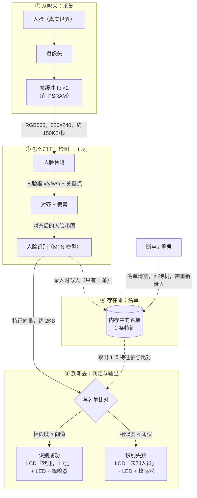

# ESP32 本地人脸识别门禁演示器 · 技术设计（TECH_DESIGN.md）

> 文档版本：v1.0　｜　建立日期：2026-09-21　｜　对应阶段：Day 5（第 1 周）
> 上游文档：`PRD.md` v1.2（产品边界与验收基线）、`research.md`（背景研究）
> 下游：Day 6 起的编码与调试
>
> 本文只回答「**用什么做、为什么**」，不含代码。产品「做什么、做到什么程度」以 `PRD.md` 为准，两者冲突时以 PRD 为准。
>
> **命名说明**：本文即 `PRD.md` 第 6 节所指的实现契约文档。Day 5 决定**改名为 `TECH_DESIGN.md`**，原暂定名 `IMPLEMENTATION_CONTRACT.md` 作废，两者是同一个东西，不并存。
>
> **本文当前完成度**：Day 5 完成「技术路线」（第 1–2 节）与「数据流图」（第 3 节）。PRD 第 6 节列出的其余契约项（阈值数值、帧率定稿、四状态转移表、异常处理表、测试脚本等）待后续 Day 回填，对应关系见第 6 节。

---

## 0. 一句话技术路线

> 在**正点原子 DNESP32S3**（ESP32-S3 双核 240MHz／16MB Flash／8MB PSRAM）上，用 **ESP-IDF 5.1.2** 搭配 **esp-who release/v1.1.0**，复用仓库已有的 **esp32-camera 驱动**采集 **RGB565／QVGA 320×240** 画面，调用 esp-who 的人脸检测与人脸识别组件在**设备本地**判出「已录入／未知」，结果经现有的 **2.4 寸 SPI LCD** 上屏，并由板载 **LED** 与 **XL9555 蜂鸣器**给出成功／失败反馈。

---

## 1. 技术路线表

「为什么」一列写选择理由，「没选什么」写被放弃的选项，「改主意的条件」写什么情况下要推翻这一行——这一列是给未来的自己留的出口。

| # | 层 | 选什么 | 为什么选它 | 没选什么 | 改主意的条件 |
|---|---|---|---|---|---|
| 1 | 开发板 | 正点原子 DNESP32S3 | 板子已在手；仓库里的 camera/lcd/led/xl9555 驱动**已针对本板适配并跑通** | 不采购 ESP32-S3-EYE：没必要，且会让已跑通的驱动作废 | — |
| 2 | 芯片 / 主频 | ESP32-S3，双核 240MHz | 板上既有事实 | — | — |
| 3 | 框架（SDK） | ESP-IDF **5.1.2** | 已安装、已编译通过；esp-who v1.1.0 声明基于 IDF 5.0，5.1.2 与 5.0 属同一大版本，API 差异小 | **不升到 5.4/5.5**：新版 esp-who 要求 IDF 5.4+，但它同时弃用了 esp32-camera，会把唯一跑通的摄像头驱动推倒重来 | 若 esp-who v1.1.0 在 5.1.2 下编译失败 → 回退到「升级 IDF」或「只用 esp-dl」（见第 4 节 D2） |
| 4 | 人脸能力来源 | **esp-who release/v1.1.0** | 技术栈与现有代码一致（同用 esp32-camera + esp-dl）；覆盖面正好是 PRD 需要的「检测 + 识别」 | 不用 esp-who master：要求 IDF 5.4+ 且已改用 esp_video、放弃 esp32-camera；不自己基于 esp-dl 从零搭：工作量与风险都超出周期 | 同 D2；若该分支核心能力缺失，则降为「只取 esp-dl 的模型层」 |
| 5 | 摄像头驱动 | 仓库已有 `components/CAMERA`（基于 esp32-camera 2.1.7） | 已跑通；PWDN/RESET 已改为经 XL9555 控制，正好匹配正点原子板 | 不用 esp-who 自带的 `who_cam`：它只适配官方板，不支持本板 | 若 esp-who 的图像输入接口与 `esp_camera_fb_t` 对接不上（D3） |
| 6 | 图像格式 / 分辨率 | **RGB565 + QVGA（320×240）**，双缓冲，帧缓冲放 PSRAM | 与 esp-who 检测／识别的输入格式一致；QVGA 是 esp-who 示例的默认档；PSRAM 8MB 充裕 | 不上 VGA：帧率和内存代价都显著变大，当前阶段无收益 | 若 QVGA 下识别率达不到 A4 的 8/10 |
| 7 | 结果显示 | 仓库已有 `components/LCD`（2.4 寸 SPI LCD，ILI9341 类，320×240） | 已跑通；正好符合 PRD「屏幕是唯一产品输出」 | 不用 esp-who 的 `who_lcd`：只支持 S3-EYE 的 st7789 屏 | — |
| 8 | 反馈（LED / 蜂鸣器） | 板载 **LED（GPIO1）** + **XL9555 蜂鸣器**（`BEEP_IO`） | 两者都已在现有 BSP 里，蜂鸣器一行调用即可驱动 | 不做 RGB 灯：**板载只有单色一颗 LED** | PRD 4.4 的 A6「两种可区分模式」只能用**亮/灭 + 闪烁次数**表达，颜色不可用（D5） |
| 9 | 名单与人脸数据存放 | **内存**（遵循 PRD 2.2） | PRD 明确规定名单不写 Flash、重启清空；这是**你 Day 4 拍过板的决定** | 暂不采用 esp-who 默认行为（写入 Flash 的 `fr` 分区） | 见 D1：PRD 暂不改，**Day 6 实测后由你决定**，实测前不得在代码里自行决定 |
| 10 | 分区表 | 需**新建 `partitions.csv`**（含 esp-who 所需的模型与人脸分区） | 现工程用默认单 app 分区，装不下 esp-who 的模型文件 | — | Day 6 按 esp-who v1.1.0 示例自带的 `partitions.csv` 落地；官方已确认其中 `fr` 分区用于存录入人脸，默认 128K；Flash 16MB，空间充足 |
| 11 | 录入触发方式 | 按 PRD 2.1：**上电后首次检测到人脸即进入录入** | 名单为空且只录 1 人，自动触发最省事 | 按键触发作为备选 | PRD 7 节把此项列为待确认；硬件上 **KEY0–KEY3 四个按键都可用**（走 XL9555），演示体验若混乱即可改按键触发（PRD 5 节的降级方案） |

---

## 2. 为什么「暂时」选这套路线

用户已明确采用示范路线、不做多方案比较，但必须交代「为什么暂时是它」。理由三条：

1. **能跑通优先于版本新。** 仓库里 camera / lcd / led / xl9555 四个驱动是当前**唯一已经被验证过的东西**。esp-who v1.1.0 用的正是同一套 esp32-camera + esp-dl 技术栈，能直接接上。
2. **新版本反而不划算。** esp-who master 要求 IDF 5.4/5.5/6.x，并且**已经放弃 esp32-camera、改用 esp_video**。采用它等于把唯一跑通的部分推倒重来，还要再装一套工具链。
3. **周期账。** 28 天里，「重装工具链 + 重写摄像头驱动 + 适配非官方板型」的风险和耗时，明显大于「使用一个停止更新但功能完整的旧分支」。

**这条路线什么时候需要改主意**：第 1 节表格最后一列，以及第 4 节的 D1–D7。

---

## 3. 数据流图

> 一张图回答一个问题：**摄像头拍到的画面，最后是怎么变成屏幕上那行「欢迎，1 号」的？**
> 每根箭头上标的都是「这一段数据是什么」。图下的表再补上「格式／多大／存在哪／活多久」。

### 3.1 逐段数据说明

「活多久」这一列是重点——它决定了「重启后还在不在」，也就是 PRD A8 / A9 要考的东西。

| # | 数据 | 格式 | 多大 | 存在哪 | 活多久 | 依据 |
|---|---|---|---|---|---|---|
| 1 | 摄像头帧 | RGB565 | 320×240×2 = **153,600 B ≈ 150KB／帧** | 帧缓冲 `fb`×2，在 **PSRAM** | 用完立刻还给驱动（`esp_camera_fb_return`），不累积 | `camera.c` |
| 2 | 人脸框 + 关键点 | 结构体（x/y/w/h + 关键点坐标） | 几十字节级 | 内存 | 只对当前帧有效 | `esp-who`，字段待 Day 6 实测 |
| 3 | 对齐后的人脸小图 | 由模型输入尺寸决定 | 待实测 | 内存 | 只对当前帧有效 | Day 6 实测 |
| 4 | **人脸特征向量** | float 数组 | **约 2KB／人**（推算值，见下方注） | **内存**（按 PRD 2.2） | 断电即消失（按 PRD）；esp-who 默认写 Flash 则永存 → **见 D1** | 官方文档 + 推算，Day 6 核实 |
| 5 | **名单** | 1 条特征 | 约 2KB | **内存** | **断电清空**（PRD 2.2 / A8）；需重新录入 | `PRD.md` 2.2 |
| 6 | 判定结果 | 枚举：已录入／未知 | 1–2 字节 | 内存变量，由状态机持有 | 保持到该人离开（PRD R10） | `PRD.md` 2.1 / 2.3 |
| 7 | 屏幕内容 | RGB565 像素 + 字符 | 整屏 150KB | `lcd_buf`（静态数组，占**片内 SRAM**） | 刷新即覆盖 | `lcd.h` |
| 8 | LED / 蜂鸣器指令 | 电平（亮/灭、鸣/停） | 1 bit | GPIO1 电平 / XL9555 寄存器 | 由 PRD 4.4 的模式决定 | `led.c`、`xl9555.h` |

> **第 4 行那个「约 2KB」是怎么来的**：官方文档给出「默认 `fr` 分区 128K，最多存 62 个 ID」，128 × 1024 ÷ 62 ≈ **2114 字节／人**；按 4 字节一个 float 反推约 **512 维特征**，512 × 4 = 2048 B，加上少量头信息正好凑到 2114 B。这是**推算，不是实测**，Day 6 核实。

### 3.2 两条必须画出来的支线

| 支线 | 走向 | 为什么必须画 |
|---|---|---|
| **未录入人员** | 比对失败 → LCD「未知人员」+ LED/蜂鸣器 → **不写入名单** | PRD F5 的核心行为：认不出的人不能被写成某个已录入编号，也不能污染名单 |
| **断电 / 重启** | 名单清空 → 回待机 → 需重新录入 | PRD 2.2 / A8 / A9 都挂在这条线上，也是「数据存在哪」这个问题的最终答案 |

> ⚠️ **图中的「内存中的名单」是 PRD 的要求，不是 esp-who 的默认行为。** esp-who 默认把录入的人脸写进 Flash 的 `fr` 分区（掉电不丢）。两者冲突的处置见第 4 节 **D1**：PRD 暂不改，Day 6 实测后由你决定。

---

## 4. 待决项与已知风险

> 原则：**不确定的就写成待决项，不写成结论。** 任何一项未定稿的参数，都不允许由实现者（人或 AI）在代码里自行假设。

| 编号 | 事项 | 现状 | 处理方式 |
|---|---|---|---|
| **D1** | 录入的人脸存 Flash 还是内存 | esp-who 官方行为：写入 Flash 的 `fr` 分区（掉电不丢），与 PRD 2.2／A8 直接冲突 | **用户决定：PRD 暂不改，Day 6 实测后决定。** 实测前不得在代码里自行决定 |
| **D2** | esp-who v1.1.0 能否在 IDF 5.1.2 下编过 | 官方只声明支持 IDF 5.0，我们是 5.1.2，未实测 | **Day 6 第一件事**：clone 仓库 → 编译 human_face_detection 示例验证。失败则回退：升级 IDF（方案 A）或只用 esp-dl（方案 C） |
| **D3** | esp-who 的图像输入接口 vs `esp_camera_fb_t` | 未验证 | Day 6 验证；若不通，考虑只取 esp-dl 的模型层，图像通路完全用现有驱动 |
| **D4** | 正点原子板不在 esp-who 支持板型列表 | 官方仅支持 S3-EYE／S3-Korvo-2／P4 | 只取 esp-who 的**检测/识别组件**；摄像头、屏幕、按键继续用仓库自有驱动 |
| **D5** | A6 的「两种可区分 LED 模式」 | 板载只有单色一颗 LED | 模式只能用「亮/灭 + 闪烁次数」表达，颜色维度不可用；PRD 4.4 的 A6 表待确认板载 LED 后定稿 |
| **D6** | 内部 SRAM 预算可能不够 | `lcd_buf` 是 150KB 的**静态数组**（`320×240×2`），占的是片内 SRAM（约 512KB）；esp-who 的模型与推理也要片内 RAM，两者会抢 | Day 6 实测可用堆内存；不够时把 `lcd_buf` 改到 PSRAM。此项属 Day 6 观察，不在 Day 5 改动 |
| **D7** | 工程名 `1.LED` | 正点原子示例残留，产物为 `1.LED.bin/elf/map` | 仅记录，不在 Day 5 范围，日后另说 |

---

## 5. 硬件事实清单（有出处，非推测）

| 项目 | 事实 | 出处 |
|---|---|---|
| 目标芯片 | `esp32s3`，双核 240MHz | `sdkconfig` |
| Flash | 16MB | `sdkconfig`（`CONFIG_ESPTOOLPY_FLASHSIZE="16MB"`） |
| PSRAM | 8MB，Octal 模式，80MHz | `sdkconfig`（`CONFIG_SPIRAM_MODE_OCT`、`CONFIG_SPIRAM_SPEED_80M`、`CONFIG_SPIRAM=y`） |
| 摄像头接口 | SCCB：SDA=GPIO39／SCL=GPIO38；数据 Y2–Y9 = GPIO4/5/6/7/15/16/17/18；VSYNC=47／HREF=48／PCLK=45；XCLK=24MHz | `components/CAMERA/camera.c` |
| 摄像头 PWDN/RESET | 不占 GPIO，经 XL9555 控制（`OV_PWDN_IO`=0x0010、`OV_RESET_IO`=0x0020） | `camera.c`、`xl9555.h` |
| 摄像头当前配置 | `PIXFORMAT_RGB565`、`FRAMESIZE_QVGA`、`fb_count=2`、帧缓冲在 PSRAM | `camera.c` |
| 屏幕 | 2.4 寸 SPI LCD（`SPI_LCD_TYPE 1`），320×240；DC=GPIO40、CS=GPIO21；SPI2：MOSI=11／CLK=12／MISO=13；背光 `LCD_BL_IO`=0x0100、复位 `SLCD_RST_IO`=0x0400、供电 `SLCD_PWR_IO`=0x0800 | `components/LCD/lcd.c`、`lcd.h`、`components/SPI/spi.h` |
| LED | 板载单颗，GPIO1，**单色** | `components/LED/led.c` |
| 蜂鸣器 | XL9555 的 `BEEP_IO`（0x0008），无独立驱动，用 `xl9555_pin_write` 驱动 | `xl9555.h` |
| 按键 | KEY0–KEY3 四个，全部接在 XL9555（0x8000/0x4000/0x2000/0x1000） | `xl9555.h` |
| IO 扩展器 | XL9555，I²C 地址 0x20，挂 I²C0（SDA=GPIO41／SCL=GPIO42，400kHz） | `xl9555.h`、`components/IIC/iic.h` |
| 已完成的初始化链 | `led_init → iic_init(I2C0) → xl9555_init → spi2_init → lcd_init → camera_init` | `main/main.c` |
| 已装依赖 | `espressif/esp32-camera` 2.1.7、`espressif/esp_jpeg` 1.3.1 | `dependencies.lock` |
| 未装 | **esp-who 未安装**（`managed_components/espressif__esp32-who/` 是空目录；上次构建 79 个组件中无 esp-who/esp-dl） | 构建产物 `build/project_description.json` |

---

## 6. 与 PRD 第 6 节「实现契约 11 项」的对应

PRD 第 6 节要求实现契约至少覆盖 11 项。本文改名为 `TECH_DESIGN.md` 后承接同样的职责，但**Day 5 只完成其中一部分**：

| PRD 要求的契约项 | 本文对应 | 状态 |
|---|---|---|
| ① 确切硬件型号 | 第 5 节 | ✅ Day 5 完成 |
| ② 摄像头／屏幕／LED／蜂鸣器／按键接口 | 第 5 节 | ✅ Day 5 完成 |
| ③ 图像分辨率、目标帧率与内存约束 | 第 1 节 #6、第 4 节 D6 | ⚠️ 部分：分辨率已定；**帧率与内存预算需 Day 6 实测** |
| ④ 录入采样数量与超时 | PRD 2.3 R1/R2 暂定值 | ⬜ 待回填定稿 |
| ⑤ 识别阈值与连续帧判定规则 | PRD 2.3 R5 | ⬜ 待回填定稿 |
| ⑥ 人脸离开与重新触发规则 | PRD 2.3 R4/R6/R7/R8 | ⬜ 待回填定稿 |
| ⑦ 四状态完整转移表 | PRD 2.1 + 2.4 | ⬜ 待回填定稿 |
| ⑧ 初始化失败与运行时异常处理 | PRD 2.4 | ⬜ 待回填定稿 |
| ⑨ 成功／失败的 LED 与蜂鸣器模式 | 第 4 节 D5 | ⚠️ 约束已明确（只能用闪次表达），具体模式待定稿 |
| ⑩ 可执行的验收测试脚本 | — | ⬜ 待产出 |
| ⑪ V1 与 V1-D 的差异 | PRD 4.4／5.1 已有定义 | ✅ 已由 PRD 覆盖，本文不重复 |

> ④⑤⑥⑦⑧ 属于「写代码前必须定稿」的参数。它们未定稿前，**PRD 2.3 的暂定值继续生效**，且不允许在代码里临时决定。

---

## 7. 本文的边界

- 本文不含代码、不含接口函数签名，也不含阈值数值。
- 本文与 `PRD.md` 冲突时以 **PRD** 为准（产品边界与验收口径优先）。
- 本文与 `research.md` 冲突时以 **本文** 为准（`research.md` 为背景研究，不构成实现约束）。
